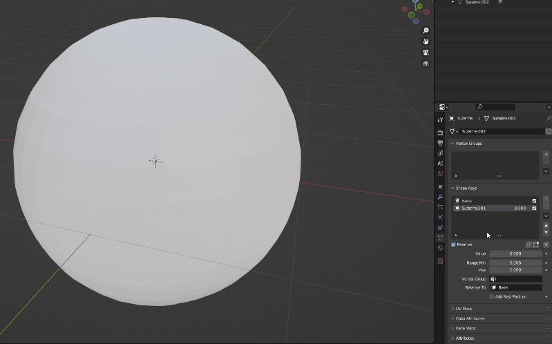
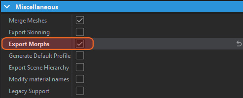
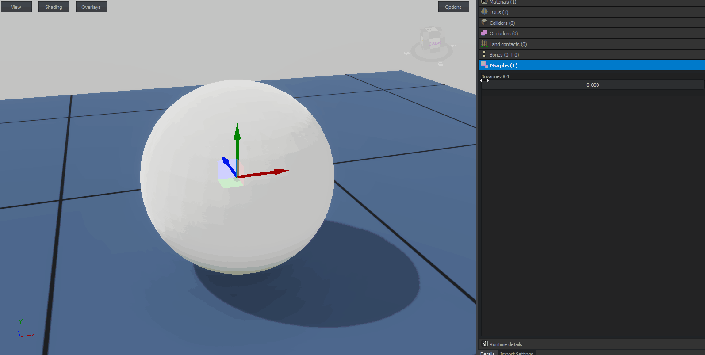

This folder contains 3 example FBX model containing blend shapes created in 3 different softwares.

After importing model into Workbench, make sure to check **Export Morphs** in **Miscellaneous** section of **Import Settings** and then reimport model.

Once that is done, you should be able to verify if **Morphs** are working  by navigating to **Details** tab and then playing with slider in the Morphs section.

Morphs can be controlled via script [SetMorphState](https://enfusionengine.com/api/redirect?to=enfusion://ScriptEditor/scripts/Core/generated/Visual/Animation.c;20) method.