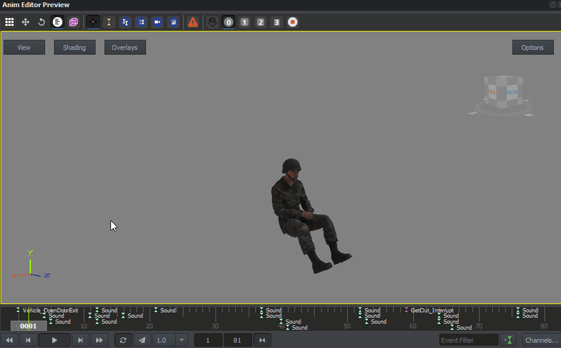
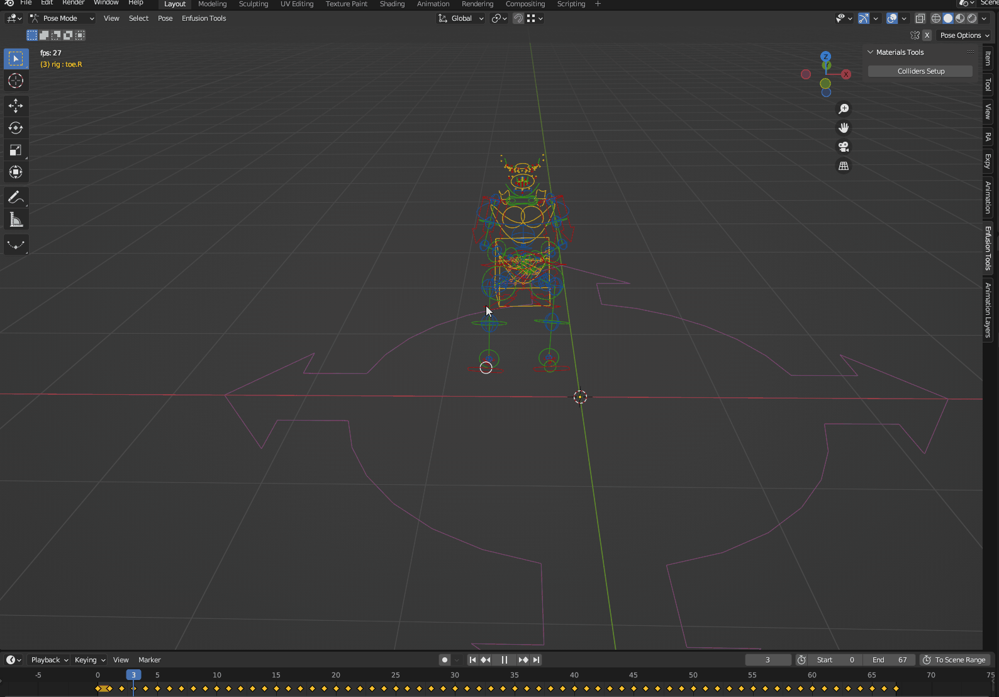
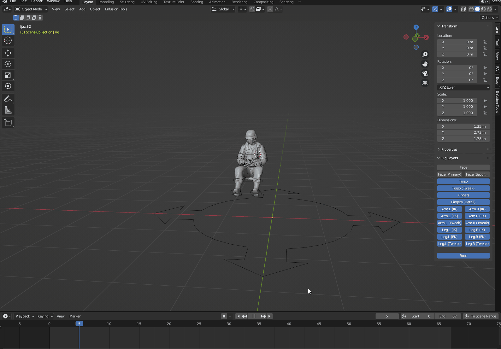

This folder contains character part of vehicle animations from base game.
# Content

## Vehicle character animations

*UAZ-469 co-driver get out animation in Animation Editor preview window*

*Blender compatible UAZ-469 co-driver get out animation from mb_p_UAZ469_codriver_getOut.blend file* 

Animations in this repository can be appended to [Character_AnimationRig_Example.blend](https://github.com/BohemiaInteractive/Arma-Reforger-Samples/blob/main/SampleMod_NewCharacter/Assets/Characters/SampleCharacter/Character_AnimationRig_Example.blend "Character_AnimationRig_Example.blend")  and then modified with NLA editor.  

